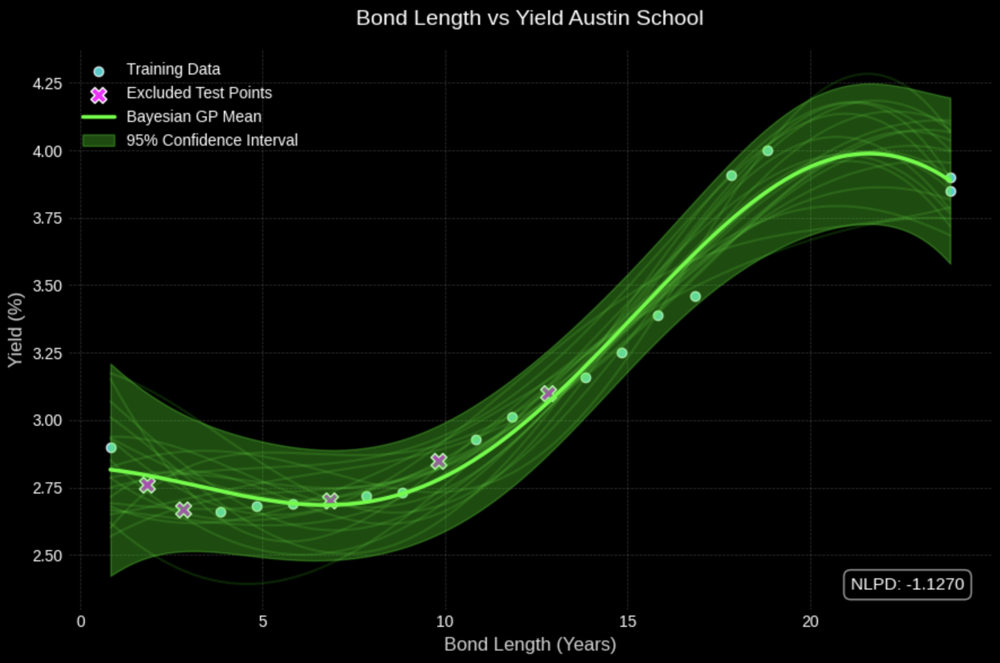
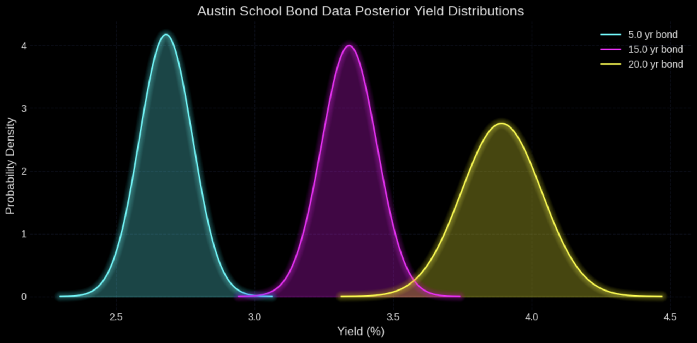

# Bond Yield Curve Modeling with Bayesian Gaussian Processes

[](https://www.python.org/)
[](https://jupyter.org/)
[](LICENSE)

This project uses Bayesian Gaussian Processes to model municipal bond yield curves. Municipal bonds are often overlooked compared to other types of bonds and are usually modeled with deterministic models that don't perform well with the limited data that is available. This project demonstrates how Bayesian Gaussian Process Regression can be applied to uncover yield curve dynamics and inherent uncertainty even with limited data.

The approach generalizes to other fixed-income instruments and bond datasets beyond municipal bonds.

## 🔍 Notebook Overview

[Data](https://github.com/AMP3000/bayesian-gp-yield_curve-modeling/tree/main/data) from [EMMA Website](https://emma.msrb.org/)


- **Bayesian Gaussian Process Regression (GP):** Flexible nonparametric modeling of bond yield curves  
- **Uncertainty Quantification:** Posterior distributions to capture predictive uncertainty  
- **Model Evaluation:** Includes train/test splits and Negative Log Predictive Density (NLPD)  
- **Comparative Analysis:** Functions to compare bond yield curves across issuers/sectors  
- **Visualization:** Matplotlib plots with confidence intervals, posterior samples, and test point markers


### Example of Models and Posterior Distributions:




## ⚡ Getting Started

Install the required libraries using pip:

```bash
pip install numpy pandas matplotlib mplcyberpunk datetime scipy sklearn
```

- Clone this repository
- Run through notebook cells to reproduce the analysis and plots


## Research Connection

This project was completed as a part of a Research for Undergraduates (REU) Program. A research paper was written alongside the code to formalize the methodology and findings. 

🔗 [Program Proceedings](https://pdxscholar.library.pdx.edu/altreu_projects/18/)
